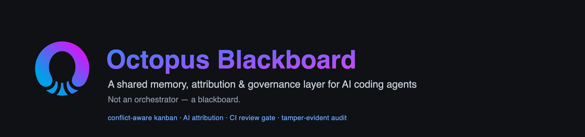
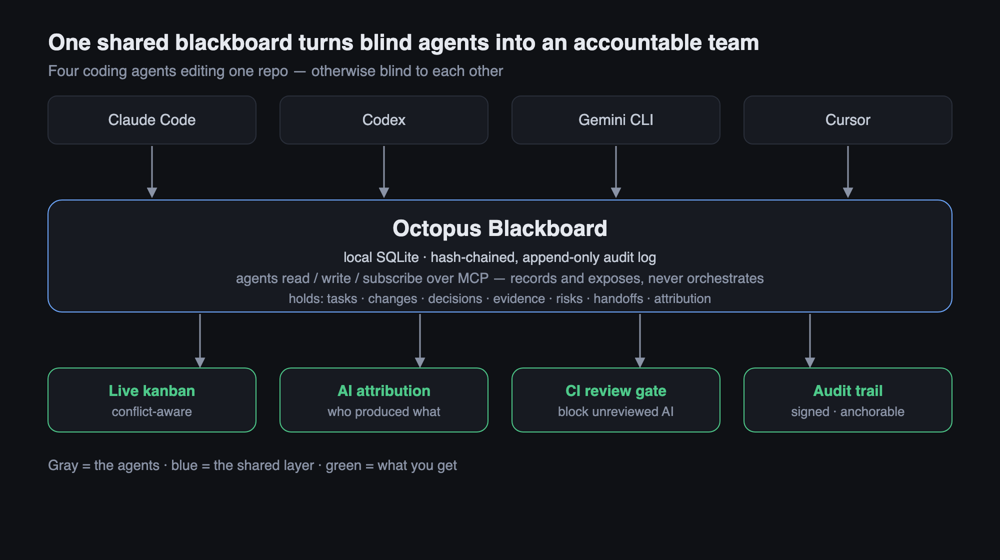
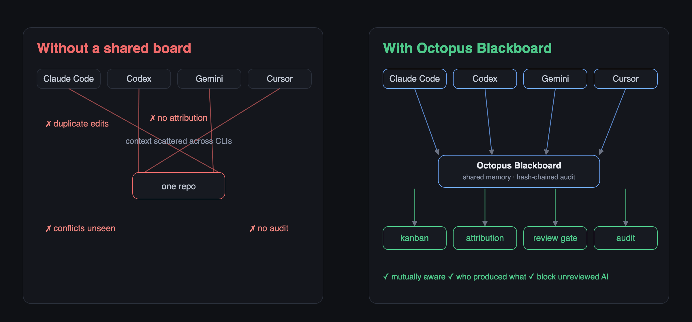
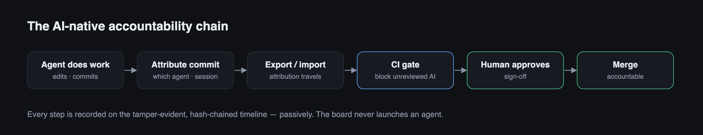
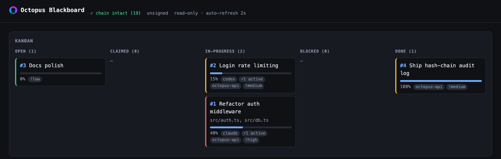

# Octopus Blackboard（章鱼黑板）

**面向 AI 编码 Agent 的共享记忆与协调层。**

> Agent 不需要另一个老板，它们需要一块共享黑板。

[English](./README.md)



---

Claude Code、Codex、Gemini CLI、Cursor、以及你本地的各种 agent，都在改同一个仓
库——但彼此失明。一个在重构 auth，另一个在改同一个文件。上下文散落在不同 CLI 里，
没人能复盘发生过什么。

Octopus Blackboard **不是 orchestrator。** 它不调度 agent、不触发 agent，也不替
agent 做任何决定。它是一个被动的、本地优先的共享记忆，只回答六个问题：

```text
谁在做什么        →  agents, tasks, claims
改了什么          →  files_changed
决定了什么        →  decisions
有什么证据        →  evidence
有哪些未决风险    →  risks
给谁留了什么话    →  messages, handoffs
```

每个 agent 只需要能够 **读黑板、写黑板、留言、附证据**。这就是全部契约。

## 为什么



企业真正怕的，不是 agent 不够聪明，而是：

- 多个 AI 工具同时改代码
- 上下文散落在不同 CLI
- 没有共享记忆、没有审计、没有 handoff
- 没有冲突认知、无法复盘

黑板正好切中这一点。每一次写入，都会向 append-only 的 `timeline` 追加一条
**防篡改的哈希链条目**，因此整段历史可审计、可复盘——任何对早期条目的事后修改都
会导致校验失败。

## 安装

```bash
npm install
npm run build      # 编译到 dist/
```

需要 Node ≥ 22。黑板就是 `.octoboard/` 下的单个 SQLite 文件，从当前工作目录向上
查找（类似 `.git`）。

## 见证效果

[`examples/two-agents.sh`](./examples/two-agents.sh) 演绎旗舰场景——Claude Code
与 Codex 在同一个仓库上共享一块板:认领冲突、实时同文件碰撞、决策、归属、落入对方
收件箱的 handoff、AI review、人类审批的 CI 门禁(阻断 → 放行)、问责计分卡、
blame→叙事,以及带 session 签名的可校验哈希链。在一个空目录里跑:

```bash
bash examples/two-agents.sh          # 需要 PATH 上有 `octoboard`
```

## CLI

```bash
octoboard init                                   # 在此处创建 .octoboard/
octoboard status                                 # 当前谁在黑板上

octoboard note "Codex is refactoring auth middleware"
octoboard claim trust-layer-policy-schema        # 认领工作；冲突时告警
octoboard message claude "Review policy edge cases before merge"
octoboard decision "Use hash-chain audit log" --why "tamper-evidence"
octoboard risk "Migration may break audit replay" --severity high
octoboard file src/auth.ts --change modified --task trust-layer-policy-schema
octoboard handoff claude "Tests pass except policy replay" --task trust-layer-policy-schema

octoboard timeline                               # 完整的哈希链历史
octoboard verify                                 # 校验链条是否完好
```

身份通过 `--as <agent>` 或环境变量 `OCTOBOARD_AGENT` 设置。用 `--board <dir>` 或
`OCTOBOARD_DIR` 指向特定黑板。

### 冲突认知

黑板从不阻塞——它只**暴露**。如果两个 agent 认领同一个 key，或改动同一个 task 的
文件，两次写入都会被记录，并对后来者告警：

```text
⚠ CONFLICT: "trust-layer-policy-schema" is also held by codex. Both claims recorded.
```

## AI 归属与共享开发记忆

Git 记录的是谁 **push** 了 commit。它不记录:是哪个 AI agent 产出了代码、在哪个
session、在哪台机器、是否被另一个 AI review 过、是否有人类批准过。随着 AI 原生开
发普及,问责必须超越 Git authorship。

黑板在 Git **之上**加一层归属——它绝不 rewrite 历史。Git 仍是代码的真相源,黑板
成为归属的真相源。

### Session(会话)

session 是一个 agent 的一段连续执行,也是归属挂靠的单位。开启后,后续每次写入都归
属到它(活跃 session 会跨 CLI 调用按 agent 记住):

```bash
export OCTOBOARD_AGENT=claude OCTOBOARD_PROVIDER=anthropic \
       OCTOBOARD_MODEL=claude-opus-4-8 OCTOBOARD_CLI=claude-code

blackboard session start --label "auth work"   # 捕获机器、分支、仓库
blackboard claim policy-engine
blackboard file src/policy.ts --change modified
# ... 做一次 git commit ...
blackboard link HEAD                            # 把该 commit 的文件归属出去
blackboard session stop
```

身份完全 provider-independent——`--provider`、`--model`、`--cli` 或对应的
`OCTOBOARD_*` 环境变量。任何 AI CLI(本地或云端)都能自我注册,不对任何厂商做假设。

### 关联 commit

`blackboard link <rev>` 通过 Git 读取该 commit 改动的文件,为活跃 session 每个文件
记一条归属。可选地在 `refs/notes/blackboard` 下写一条 additive 的 `git notes`:

```bash
blackboard link HEAD --note
blackboard attribute <sha> --file src/x.ts --actor human --name Ran  # 手动
```

### Review

```bash
blackboard review HEAD --by ai   --name codex --outcome approved --note "tests pass"
blackboard review HEAD --by human --name Ran   --outcome approved
```

### 查询共享记忆

```bash
blackboard who src/auth.ts             # git 作者 + 触碰过它的 AI session
blackboard who src/auth.ts --line 42   # 哪个 session 引入了这一行
blackboard explain HEAD                # 归属 + review + 相关决策
blackboard commits claude-code         # 哪些 commit 来自某个 AI / CLI
blackboard unreviewed                  # 从未经人类 review 的 AI commit
blackboard joint claude codex          # 被两个 agent 同时改过的文件
blackboard timeline --session <id>     # 单个 session 的 HH:MM 时间线
```

每一条归属、review、session、决策都会同时记入哈希链 `timeline`,因此完整的问责历
史防篡改、可复盘。`blackboard` 与 `octoboard` 是同一个命令。

## 治理与问责链



归属的意义在于**能落地约束**。从"干活"到"合并门禁"的完整链路:

```text
agent work → commit attribution → export/import → CI check → human-review gate
```

### CI 门禁(`check`)

把查询变成可执行门禁。只读——报告 pass/fail 并以非零退出;真正 block 的是 CI 系统,
黑板从不阻塞。

```bash
# CI 里,在 PR 分支上——存在未经人类 review 的 AI commit 就让构建失败:
blackboard check --range origin/main..HEAD --require-human-review
echo $?   # 0=通过, 1=有违规

blackboard check            # 默认门禁:校验链 + 要求人类 review
```

### 可携带性(`export` / `import` / `trailers`)

归属是本地优先的;这几条让它活过 `git push`,进入团队板子或 CI:

```bash
blackboard export --range origin/main..HEAD --out attribution.json  # 开发机上
blackboard import attribution.json                                   # 团队板 / CI 上
blackboard trailers HEAD                                             # commit message 用的 trailer 行
```

`import` 幂等(按行 id 去重)。bundle 携带 attributions、reviews、sessions、相关 decisions。

### 订阅(`watch`)

补齐 read/write/**subscribe**/message 契约。被动:轮询并报告,绝不推工作。

```bash
blackboard watch --for claude     # 只提示发给我的 message/handoff/冲突
blackboard watch                  # 全量流
blackboard watch --once           # 一次性轮询(脚本用)
```

### 签名 session(`sign` / `verify`)

最小身份(v0):每个 session 一对 Ed25519 密钥(私钥留本地 `.octoboard/keys/`,已
gitignore)。对 timeline head 签名,让 `verify` 区分**可信**与仅仅"自证":

```bash
blackboard sign        # 用当前活跃 session key 对 head 签名
blackboard verify      # 链完整性 + 哪些 session 签过、trusted/stale
```

`session stop` 时自动对 head 签名。一旦任何更早的历史被改动,覆盖该 head 的签名就变
**stale**——即使签名本身在密码学上仍有效,篡改也会显形。这还不是完整 PKI(无密钥分
发/吊销)。

## 摄取 CLI 会话记录

不必手动调 API——直接从 CLI 的会话 transcript 灌入,文件改动、决策、笔记都会落到当前
session 上:

```bash
blackboard ingest ~/.claude/transcript.jsonl --format claude-code
blackboard ingest session.jsonl --format codex        # 还支持:gemini、grok
blackboard ingest events.json    --format generic --dry-run
```

`claude-code`/`codex`/`gemini`/`grok` 用一套保守的 tool-use JSONL 启发式(从
`file_path`/`notebook_path` 及 patch/write 工具调用里找文件改动)。`generic` 读一套
规范化 schema——这是**任意** CLI 的稳定接入路径:

```json
{ "events": [
  { "type": "file", "path": "src/auth.ts", "change": "modified" },
  { "type": "decision", "title": "use ed25519", "rationale": "small keys" },
  { "type": "note", "text": "left policy edge cases for review" }
] }
```

## 团队后端

板子保持本地优先;sync 把可携带的归属记录(绝不含板子的私有哈希链)同步到团队存储
——一个共享文件或 Postgres:

```bash
blackboard sync push --target /shared/team.json          # 文件(共享盘)
blackboard sync pull --target postgres://host/blackboard # 团队数据库(需要 `pg`)
```

`export` 用你活跃 session 的密钥对 bundle 签名;`import` 会校验,`import
--require-signed` 拒收未签名或被篡改的 bundle——所以导入的归属有来源真实性,而不只是
按 id 去重。

如果把 head 锚定到外部,防篡改能力比 DB 内哈希链更强:

```bash
blackboard anchor --git-note              # 把 seq:hash 记到 commit 上(或 --out file)
blackboard verify --against git-note      # 证明历史没被截断/改动
```

在线状态与合规:

```bash
blackboard session heartbeat        # 标记 session 存活(区分活跃/陈旧)
# `blackboard file ...` 现在会在另一个活跃 session 正在改同一文件时告警

blackboard prune --before 2026-01-01T00:00:00Z   # 保留策略:删旧 messages/
                                                 # evidence/file-changes(时间线保留)
blackboard redact 42 --reason PII                # 隐藏某条时间线条目的内容
```

`prune` 绝不动 append-only 时间线(审计轨迹)。`redact` 在**所有读路径**上抹掉内容
——时间线覆盖层*和*底层源行(消息正文、evidence 笔记等),让 `inbox`/`status`/看板
都无法泄露——同时保持哈希链可校验。它不是密码学擦除:原始 summary 仍留在时间线行里
以保证链可验,所以别存你必须能销毁的机密。要防御有数据库写权限的攻击者,请把 head
hash 锚定到外部(一个 commit、一份日志、另一台机器)——当 `verify` 无法确认尾部时会
显示 `unanchored` 警告。

## 任务与看板（Kanban）

任务就是看板卡片——编号、内容、负责人（哪个 agent / CLI）、project、影响面、风险、
实时进度。**"通知 agent" 是被动的:** 派发任务 = 在该 agent 的收件箱里放一条"请查看
任务 #N";agent 读到后自己决定是否开工——板子从不启动任何人。



*`blackboard serve` 的实时看板——只读、自动刷新。每张卡显示 任务号、进度条、负责人、
活跃 agent 数（⚡）、project、按风险着色的边框。*

```bash
blackboard task add auth-mw --title "Refactor auth middleware" \
  --project octopus-api --impact "src/auth.ts, src/db.ts" --risk high
blackboard assign 1 claude       # → 在 claude 收件箱放 "请查看任务 #1 …"
blackboard progress 1 40         # → #1 变 in-progress,40%
blackboard tasks                 # 看板视图,按状态分组
blackboard task show 1           # 完整卡片:负责人、project、影响面、风险、文件
```

只读的 `serve` 看板把它们渲染成实时 Kanban（按状态分列;每张卡显示 编号、标题、进度
条、负责人、活跃 agent 数、project、按风险着色的左边框）。agent 通过 MCP 工具
`board_task_define`、`board_assign`、`board_progress`、`board_tasks` 驱动——agent 边干
边调 `board_progress`,进度条就实时动。

## 可见性

```bash
blackboard report          # 计分卡:review 覆盖率、AI/人类比例、按 agent 分解
blackboard blame src/auth.ts 42   # 从一行回溯 → 写它的 session,及其其它工作、
                                  # 决策、handoff(blame → 叙事)
blackboard serve           # 只读本地 web 看板(http://localhost:4319)
```

看板零依赖(`node:http`)、严格只读(拒绝非 GET),自动刷新:实时时间线、sessions、
冲突/归属状态,以及问责计分卡。

## MCP 服务器 — 接入任意 CLI

黑板用标准 MCP over stdio,所以**任何**支持 MCP 的客户端(Claude Code、Cursor、
Codex、Gemini CLI、VS Code、Windsurf……)都能读写这块板。一步生成你客户端专属的配置:

```bash
blackboard mcp-config cursor        # → ~/.cursor/mcp.json 片段
blackboard mcp-config claude-code   # → 项目 .mcp.json 片段
blackboard mcp-config codex         # → ~/.codex/config.toml(TOML)
blackboard mcp-config gemini        # → ~/.gemini/settings.json 片段
blackboard mcp-config vscode        # → .vscode/mcp.json(servers 块)
blackboard mcp-config               # → 通用 mcpServers JSON(任意客户端)
```

每条都会打印粘贴位置和现成片段,例如:

```json
{
  "mcpServers": {
    "blackboard": {
      "command": "npx",
      "args": ["-y", "octopus-blackboard-mcp"],
      "env": { "OCTOBOARD_AGENT": "cursor" }
    }
  }
}
```

agent 身份默认取客户端名(Cursor 写成 `cursor`,Codex 写成 `codex`),用 `--agent`
覆盖。板子从工作目录的 `.octoboard/` 自动发现,或用 `--dir` 固定。两个 CLI 指向同一
个 `.octoboard/` 就共享一块板——这正是全部意义所在。

提供的工具——协调:`board_status`、`board_timeline`、`board_note`、`board_claim`、
`board_task_define`、`board_task`、`board_tasks`、`board_assign`、`board_progress`、
`board_message`、`board_inbox`、`board_handoffs`、`board_decision`、
`board_evidence`、`board_file_changed`、`board_risk`、`board_handoff`、
`board_heartbeat`、`board_since`;归属:`session_start`、`session_stop`、
`board_link`、`board_attribute`、`board_review`、`board_who`、`board_explain`、
`board_blame`、`board_unreviewed`、`board_report`;治理与可携带:`board_check`、
`board_export`、`board_import`、`board_trailers`、`board_sign`、`board_trust`、
`board_prune`、`board_redact`、`board_ingest`。每个工具都接受可选的 `agent` 参数,
用于按调用覆盖身份。

推荐模式：agent 在**开始工作前**调用 `board_status` 看看其他人在干什么，然后边做
边写。

## 数据模型

| 层 | 表 | 作用 |
|---|---|---|
| **谁在场** | `agents`、`sessions` | provider 无关的身份、session 上下文 |
| **正在发生** | `tasks`、`messages`、`handoffs` | 协调——认领、留言、交接 |
| **谁产出了什么** | `attributions`、`reviews` | AI/人类归属与 review,以 commit 为键 |
| **沉淀的事实** | `decisions`、`evidence`、`files_changed`、`risks`、`timeline` | 可审计的共享记忆 |

`timeline` 是 append-only 的哈希链，所有其他写入也会记录进去，因此黑板与它的审计
日志永远不会发散。

## 技术形态

```text
better-sqlite3（本地优先，默认）
  + MCP 服务器   （读 / 写黑板）
  + CLI          （octoboard ...）
  + 哈希链审计日志（timeline）
  + 可选 Postgres sync   （规划中）
  + 可选 git / file watcher（规划中）
```

## 状态

早期 MVP（v0.1）。已可用:本地 SQLite 黑板、CLI(`octoboard` / `blackboard`)、
MCP 服务器、可校验的哈希链 timeline、一等 session、provider 无关的 AI/人类归属(挂
到 Git commit)、review,以及查询层(`who`、`explain`、`commits`、`unreviewed`、
`joint`)。Git 集成为只读 + additive `git notes`——绝不 rewrite 历史。Postgres
同步与变更订阅在路线图上。

## 许可证

Apache-2.0 © Octoryn。见 [LICENSE](./LICENSE)。
