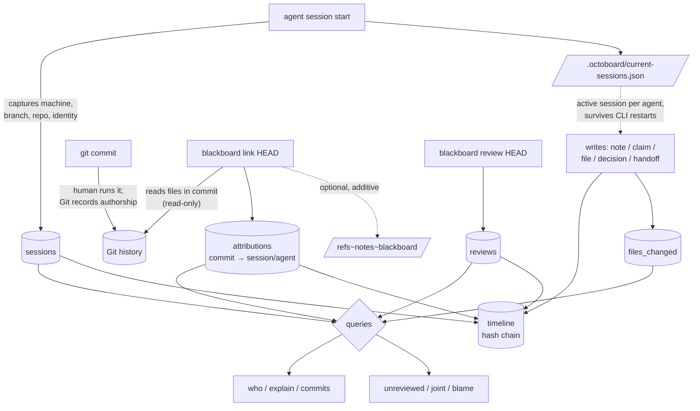

# Attribution data flow

How a change moves from an agent's keystrokes to a queryable, auditable
attribution record — and where the boundaries are.

> Git is the source of **code**. The blackboard is the source of **attribution**.
> The blackboard never rewrites Git history.

## The lifecycle

## Step by step

1. **`session start`** — opens a `sessions` row capturing `machine`,
   `working_directory`, `git_branch`, `repository`, and the agent's
   provider-independent identity (`provider` / `model` / `cli` / `version`). The
   session id is written to `.octoboard/current-sessions.json`, keyed by agent,
   so every later CLI process (a separate OS process) attributes to it.

2. **Work happens** — `note`, `claim`, `file`, `decision`, `handoff`. Each is
   one SQLite transaction that also appends a `timeline` entry. The active
   session id is stamped onto every write and folded into the hash.

3. **The human commits** — an ordinary `git commit`. Git records who *pushed*.
   The blackboard does not touch this step.

4. **`link <rev>`** — resolves the rev to a full sha (`git rev-parse`), reads
   the files the commit touched (`git show --name-only`, read-only), and writes
   one `attributions` row per file, denormalizing the session's
   provider/model/cli so later queries are cheap and stable. `.octoboard/`
   paths are never attributed. With `--note` it also writes an **additive**
   `git notes` entry under `refs/notes/blackboard` — no existing object is
   rewritten.

5. **`review <rev>`** — records a `reviews` row (human or AI, with an outcome).
   Like `link`, it resolves the rev to a full sha so reviews and attributions
   share the same key.

6. **Query** — `who`, `explain`, `commits`, `unreviewed`, `joint`, and
   line-level `blame` read across `attributions`, `reviews`, `files_changed`,
   `sessions`, and Git.

## Why the sha is the join key

`link`, `attribute`, and `review` all resolve their revision argument to a full
commit sha before storing. This is what lets `blackboard review HEAD` clear a
commit that `blackboard link HEAD` attributed earlier — both collapse to the
same 40-char key. Storing the literal `"HEAD"` would silently break
`unreviewed` and `explain`. (There is a regression test for exactly this.)

## What is tamper-evident, and what is not

Everything the blackboard records — every attribution, review, session
boundary, and decision — also lands in the `timeline` hash chain, so after the
fact you cannot quietly alter *who produced what* without `verify` failing.

The chain protects the blackboard's own records. It does **not** prove the Git
commit itself is unmodified — that is Git's job (and, if you want cryptographic
commit integrity, signed commits). The two layers compose: Git vouches for the
code; the blackboard vouches for the attribution narrative around it.

## Boundaries (by design)

The attribution layer only records, shares, and exposes. It does **not**
orchestrate, execute, assign, trigger, or schedule. `link` and `review` are
explicit, human- or agent-initiated acts — nothing auto-fires on commit. Keeping
attribution a deliberate step is what keeps the blackboard passive.
