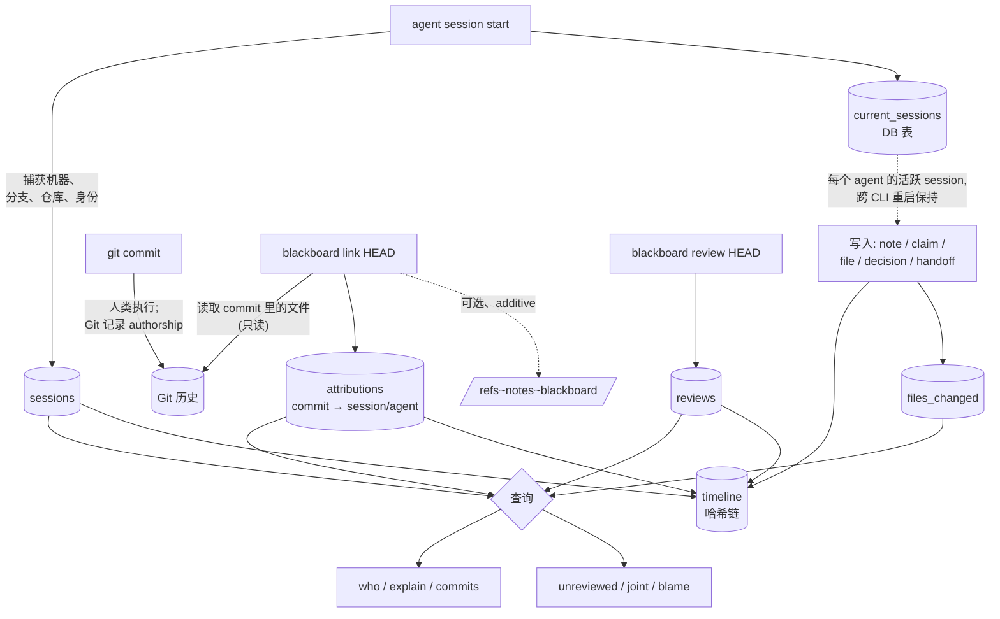

# 归属数据流

[English](./attribution.md)

一个改动如何从 agent 的敲键，变成可查询、可审计的归属记录——以及边界在哪里。

> Git 是**代码**的真相源。黑板是**归属**的真相源。黑板绝不 rewrite Git 历史。

## 生命周期

## 逐步拆解

1. **`session start`** —— 开一行 `sessions`，捕获 `machine`、`working_directory`、
   `git_branch`、`repository`,以及 agent 的 provider 无关身份(`provider` /
   `model` / `cli` / `version`)。session id 记入 `current_sessions` DB 表、按 agent
   为键,于是后续每个 CLI 进程(独立的 OS 进程)都归属到它——且 start/stop 是事务
   性的,并发 CLI 无法竞争这个指针。

2. **干活** —— `note`、`claim`、`file`、`decision`、`handoff`。每一个都是一个 SQLite
   事务,同时追加一条 `timeline` 条目。活跃 session id 会盖在每次写入上,并折进哈希。

3. **人类提交** —— 普通的 `git commit`。Git 记录谁 *push* 了。黑板不碰这一步。

4. **`link <rev>`** —— 把 rev 解析成完整 sha(`git rev-parse`),读取该 commit 改动的
   文件(`git show --name-only`,只读),为每个文件写一行 `attributions`,并把
   session 的 provider/model/cli 反规范化下来,让后续查询便宜又稳定。`.octoboard/`
   路径绝不归属。带 `--note` 时还会在 `refs/notes/blackboard` 下写一条 **additive** 的
   `git notes`——不 rewrite 任何已有对象。

5. **`review <rev>`** —— 记一行 `reviews`(人类或 AI,带一个 outcome)。和 `link`
   一样,它把 rev 解析成完整 sha,好让 review 与 attribution 共用同一个键。

6. **查询** —— `who`、`explain`、`commits`、`unreviewed`、`joint` 以及行级 `blame`,
   跨 `attributions`、`reviews`、`files_changed`、`sessions` 和 Git 读取。

## 为什么 sha 是 join key

`link`、`attribute`、`review` 在存储前都把它们的 revision 参数解析成完整 commit sha。
正是这一点,让 `blackboard review HEAD` 能清掉先前 `blackboard link HEAD` 归属的那个
commit——两者都塌缩到同一个 40 字符键。若存字面量 `"HEAD"`,会悄悄弄坏 `unreviewed`
和 `explain`。(有一条回归测试专门盯这个。)

## 什么被防篡改保护,什么不被

黑板记录的一切——每一条归属、review、session 边界、决策——也都落进 `timeline` 哈希
链,所以事后你无法悄悄改动*谁产出了什么*而不让 `verify` 失败。

每条条目的哈希覆盖前一条的哈希外加一个严格递增的 `seq`,当前 head(`seq` + `hash`)
锚定在一行 `meta` 里。`verify` 检查三件事:每个链接可重算、`seq` 连续(删中间行会被
抓到)、以及存活的尾部仍与锚定的 head 匹配(删*最新*行也会被抓到)。要同时防住篡改
锚点的攻击者,请定期把 head hash 记到 DB 之外(一个 commit、一份日志、另一台机器)
——board 通过 `verify` 暴露它。

哈希链保护的是黑板自己的记录。它**不**证明 Git commit 本身未被改动——那是 Git 的活
(若你要密码学级别的 commit 完整性,用 signed commits)。两层组合:Git 为代码背书;
黑板为围绕它的归属叙事背书。

多个 CLI 共享一块板时,写入安全串行:每次修改都跑在一个 *immediate* SQLite 事务里,
于是并发写者轮流来(受 `busy_timeout` 约束),而不是某一个悄悄失败。

## 已知限制(defer)

- **合并 commit** 归属 0 个文件:`git show --name-only` 默认对 merge 什么都不打印,
  所以 `link` 只记一条整 commit 级归属、没有按文件的行。归属 merge 带进来的文件需要
  一个 first-parent/diff-tree 的取舍,这是有意 defer 的。
- 被 link 的 commit 里**删除的文件**仍被归属为"produced",这在语义上可能不对。等一个
  更清晰的"删除意味着什么归属"模型再做,暂 defer。

两者都记在这里、而非默默处理,好让数据的消费方知道边界所在。

## 边界(设计使然)

归属层只记录、共享、暴露。它**不**编排、不执行、不分配、不触发、不调度。`link` 和
`review` 都是显式的、由人或 agent 发起的动作——没有任何东西在 commit 时自动触发。把
归属保持为一个刻意的步骤,正是黑板保持被动的原因。
